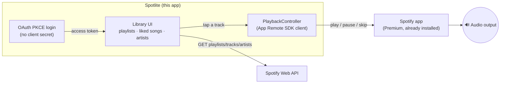

# Spotlite


A lightweight, native Android Spotify client. Browses your **entire**
library — every playlist, every saved song, every followed artist — through
the Spotify Web API, and plays tracks by driving the real Spotify app via
the App Remote SDK, instead of trying to stream audio itself.

Built to feel fast on low-end phones: no Paging3, no Glide, no dynamic
Material You theming, no large images decoded for small rows. Release build
is **~1.5 MB**.

## How it fits together



Spotlite never touches an audio buffer itself — it's a fast, custom
browsing surface in front of the Spotify app's own playback engine.

## Why it needs the Spotify app installed

Spotify's public API has no way for a third-party app to stream audio
itself — only the **App Remote SDK** can do that, and it works by
remote-controlling a real, already-installed Spotify app (Premium required)
rather than playing audio in-process.

## What it covers

- **Playlists** — every playlist in your library, paginated in as you
  scroll, opens into its full tracklist
- **Liked Songs** — your entire saved-tracks library, same infinite-scroll
  treatment
- **Followed Artists** — cursor-paginated through all of them, opens into
  an artist's top tracks
- **Now Playing bar** — play/pause/skip, backed by a live subscription to
  the Spotify app's player state
- **Login** — Spotify OAuth via PKCE, so no client secret ever ships
  inside the app

## Why it's light

| Typical choice | Spotlite uses instead | Why |
|---|---|---|
| Paging3 | hand-rolled `OffsetPager` | one dependency chain fewer for the same scroll-triggered loading |
| Glide | Coil | lower memory overhead, native Compose support |
| Full-res album art | capped ~96px decode target | a 48dp row never needed the 640px image Spotify offered |
| Dynamic Material You theming | one static color scheme | no per-frame theme recomposition cost |
| Spotify's auth library | ~60 lines of manual PKCE | no extra AAR, no client secret to protect |
| R8 shrinking | on, with targeted keep rules for the App Remote SDK | release APK lands around 1.5 MB |

## One-time setup

1. **Create a Spotify app** at the
   [developer dashboard](https://developer.spotify.com/dashboard) → Create app.
   - Add a Redirect URI: `spotlite://callback`
   - Enable the **Android** platform, package name `com.rusty.spotlite`, and
     give it your device's SHA-1 debug signing fingerprint (get it with
     `./gradlew signingReport`).
   - Copy the **Client ID**.
2. Add it to `local.properties` (already gitignored, so it never ends up
   in the repo — it's not secret, but it's tied to your own developer
   dashboard):
   ```properties
   spotify.clientId=your-client-id-here
   ```
   `app/build.gradle.kts` reads this into `BuildConfig.SPOTIFY_CLIENT_ID`,
   which [`Config.kt`](app/src/main/java/com/rusty/spotlite/Config.kt) uses.
3. **Download the App Remote SDK AAR** — see
   [`app/libs/README.md`](app/libs/README.md) for the one-time download step
   (it's not on Maven Central, so Gradle can't fetch it for you).
4. Build and install:
   ```bash
   ./gradlew installDebug
   ```
5. Make sure the real Spotify app is installed and logged into Premium on
   the same device, then log in inside Spotlite.

## Architecture

- `auth/` — hand-rolled OAuth PKCE login (no client secret needed, no third
  party auth library)
- `network/` + `model/` — Retrofit + kotlinx.serialization client for the
  Web API (playlists, liked songs, followed artists, artist top tracks)
- `remote/` — wraps the App Remote SDK for play/pause/skip and now-playing
  state
- `repo/` — flattens Spotify's offset/cursor pagination into simple pages
- `ui/` — Compose screens (Login, Library tabs, Playlist detail, Artist
  detail) plus a hand-rolled `OffsetPager` that drives infinite-scroll lists
  without pulling in the Paging3 dependency chain

## License

AGPL-3.0-or-later — see [LICENSE](LICENSE).
